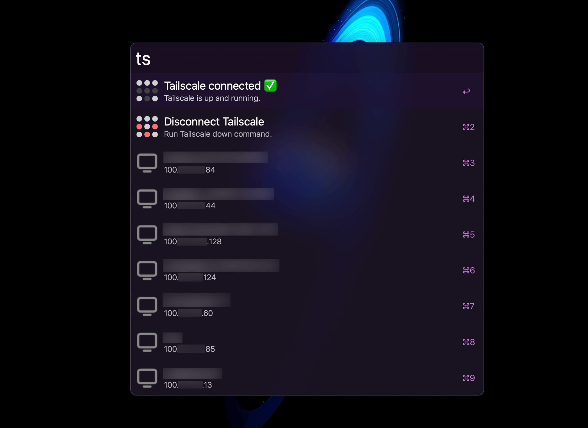

# alfred-tailscale

An Alfred workflow to control tailscale and copy the ip address of a connected device to your clipboard.

# Usage
Download the .alfredworkflow file and add it to Alfred. Hit the `ts` command to either disconnect, if tailscale is connected or connect, if tailscale is disconnected.

If tailscale is connected, it will show a list of devices that are connected to your tailscale account.

